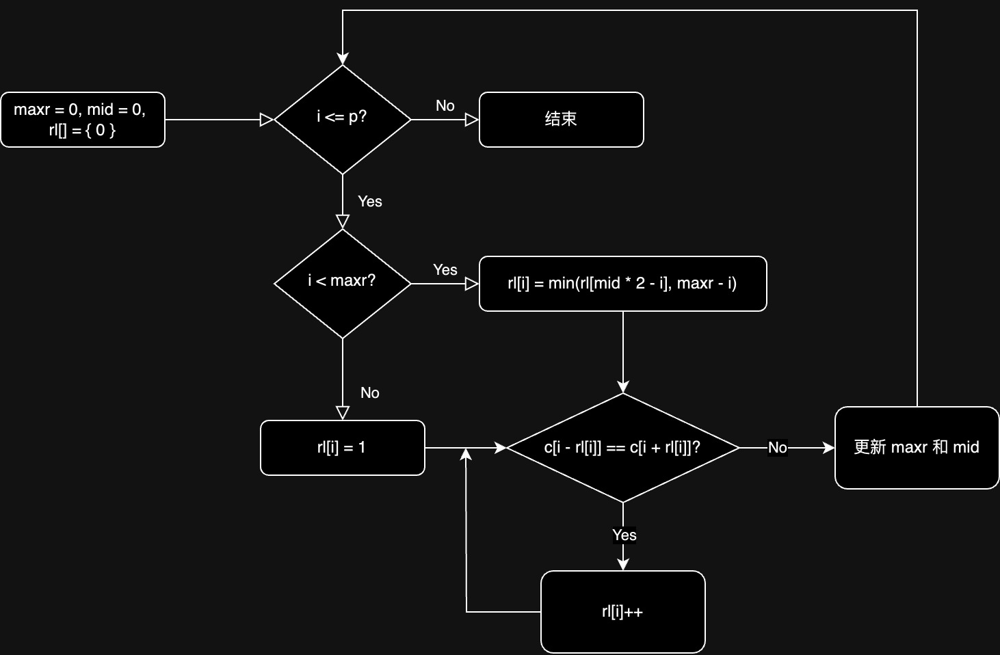

## 马拉车 (manacher) 算法求回文串

本地测试运行时间（程序中输入字母串会对字母串直接求解，输入数字 $n$ 则会生成一个长度为 $n$ 的数据再求解）：
 
| 数据范围   | n = 5000  | n = 100000 | n = 2000000 | n = 20000000 |
| ---------- | --------- | ---------- | ----------- | ------------ |
| 暴力判断法 | 8.658302s | 超时       | 超时        | 超时         |
| 中心拓展法 | 0.013825s | 1.561327s  | 超时        | 超时         |
| manacher   | 0.000090s | 0.001632s  | 0.046973s   | 0.316891s    |

### 1. 预处理

`abccba` 的对称中心不在字母上。为了保证对称中心在字母上，我们在字母间隔处加上一个字符 `#`，另外在字符串头部加入一个 `$`，防止遍历时下标溢出。原字符串成为 `$#a#b#c#c#b#a#`。

### 2. 从左往右求以每个字母为中心的最长回文串

用 `maxr` 变量和 `mid` 变量从左往右维护目前为止所有回文串的最右端和对应回文串中最长者的中心下标。`rl[i]` 表示以 `i` 为中心的最长回文子串的长度。算法流程图如下：



流程中，显然有 `mid <= i`。考虑求 `rl[i]`，此时对于 `i` 左边的 `rl[]` 均已经求出。`i` 关于 `mid` 的对称位置 `rl[2 * mid - i]` 已经求出。

显然，由于 `mid` 回文串的存在，若 `2 * mid - i` 处有一个长度为 `rl[2 * mid - i]` 的回文串，则 `i` 处也有一个长度至少为 `min(rl[2 * mid - i], maxr - i)` 的回文串，注意这个公式里 `maxr - i` 的存在是由于 `mid` 这个回文串的最右端是 `maxr`，我们不知道 `maxr` 右边的信息。接下来以 `i` 为中心继续拓展回文串。若能拓展至少一次，则 `i` 会扩展当前能达到的最右端，此时更新 `maxr = i + rl[i], mid = i`。

## 3. 线性复杂度证明

考虑以下代码：

```c
int maxr = 0, mid = 0, long_len = 0, long_mid = 0;
for (int i = 1; i <= p; i++) {
    if (i < maxr) {
        rl[i] = min(rl[mid * 2 - i], maxr - i);
        // rl[i] 表示以 i 点为对称轴的回文子串的最大长度
    } else {
        rl[i] = 1;
    }
    int f = 0;
    while (c[i - rl[i]] == c[i + rl[i]]) {
        rl[i]++;
        f = 1;
    }
    if (f) {
        maxr = i + rl[i];
        mid = i;
    }
    if (rl[i] > long_len) {
        long_len = rl[i];
        long_mid = i;
    }
}
```

该代码是一层 `for` 循环套一层 `while` 循环。当边界 `maxr` 不需要扩展时，计算 `rl[i]` 只需要一步就行了。当 `maxr` 需要扩展时，`maxr` 最多被扩展 $n$ 次，所以 `while` 循环节在整个算法中最多执行 $2n$ 次，其他操作均为线性。所以整个复杂度是 $O(n)$ 的。
